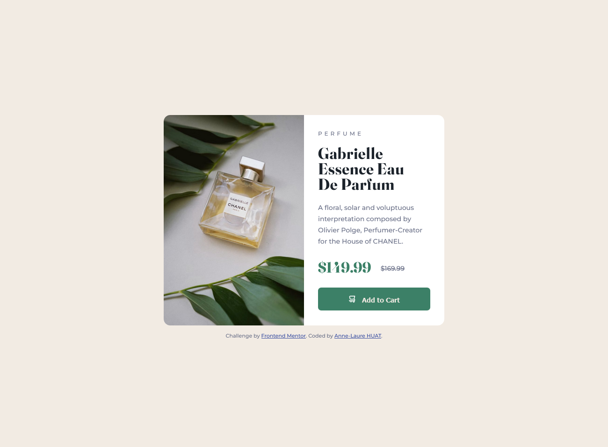
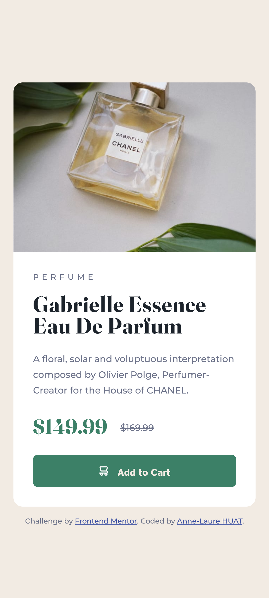

# Frontend Mentor - Product preview card component solution

This is a solution to the [Product preview card component challenge on Frontend Mentor](https://www.frontendmentor.io/challenges/product-preview-card-component-GO7UmttRfa). Frontend Mentor challenges help you improve your coding skills by building realistic projects. 

## Table of contents

- [Overview](#overview)
  - [The challenge](#the-challenge)
  - [Screenshot](#screenshot)
  - [Links](#links)
- [My process](#my-process)
  - [Built with](#built-with)
  - [What I learned](#what-i-learned)
  - [Continued development](#continued-development)
  - [Useful resources](#useful-resources)
- [Author](#author)
- [Acknowledgments](#acknowledgments)

**Note: Delete this note and update the table of contents based on what sections you keep.**

## Overview

### The challenge

Users should be able to:

- View the optimal layout depending on their device's screen size
- See hover and focus states for interactive elements

### Screenshot

### Links

- Solution URL: https://github.com/Hibiscuit0/FrontEndMentor-CardComponent
- Live Site URL: https://front-end-mentor-card-component.vercel.app/

## My process
oops... I tried to set the basics, guessing which structure would be correct, then focused on details.. 

### Built with
- Semantic HTML5 markup
- CSS custom properties
- Flexbox
- Mobile-first workflow (I tried...)

### What I learned
I used this challenge to practice CSS flexbox.

### Continued development
I still need to practice CSS flexbox. Maybe doing this challenge a second time to see if I can have something cleaner.

### Useful resources
- [Complete guide to flexbox](https://css-tricks.com/snippets/css/a-guide-to-flexbox/) - All flexbox explained in this guide.

## Author
- Frontend Mentor - [@Hibiscuit0](https://www.frontendmentor.io/profile/Hibiscuit0)

